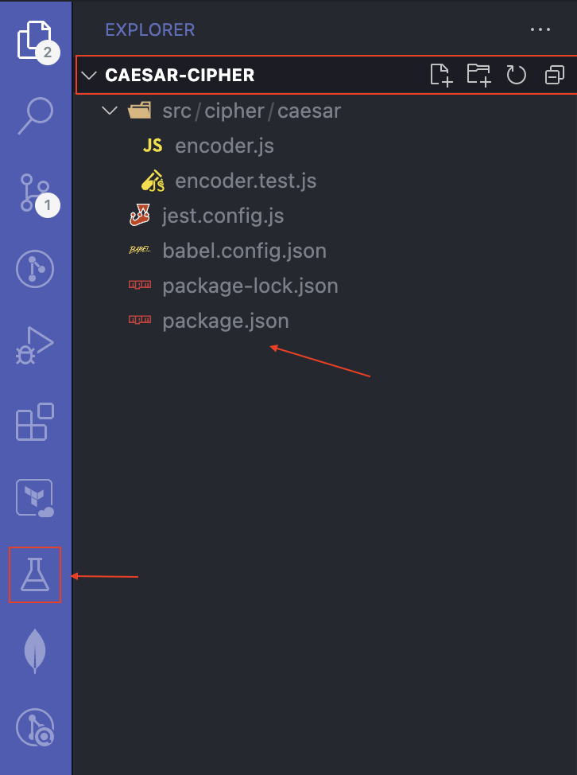

# Ukesoppgave 02

## Caesar Cipher

[Kilde](https://dev.to/manuartero/setup-jest-from-scratch-in-a-vanilla-js-project-47o0)

### 1. Initier et nytt npm prosjekt

```node
$ npm init -y
```

---

### 2. Oppdater **package.json** ved å legge til **type** og endre kjøre kommandoene i **scripts**

```diff
{
    "name": "todoapp",
    "version": "1.0.0",
    "description": "",
    "main": "index.js",
+   "type": "module",
    "scripts": {
-       "test": "echo \"Error: no test specified\" && exit 1"
+       "test": "jest",
+       "dev": "nodemon"
    },
    "keywords": [],
    "author": "Abebe Bediye",
    "license": "MIT"
}
```

- **type: module** forteller node at vi vil bruke modulbasert (ES6) syntax (eks: **import** isteden for **require**)
- **scripts**: kommandoer som vi kan kjøre med **npm run [kommando]**

---

### 3. Innstaller babel, nodemon og jest

```node
$ npm install --save-dev jest nodemon babel-jest @babel/preset-env @babel/core jest-environment-jsdom
eller
$ npm install -D jest nodemon babel-jest @babel/preset-env @babel/core jest-environment-jsdom
```

Node vil oppdatere **package.json** med et nytt felt **devDependecies** og installere koden for de pakkene i **node_modules** mappen. Node vil også opprette en **package-lock.json** fil som du ikke trenger å bry deg om men den innholder informasjon om hvilke versjoner som skal installeres.

Les mer om **dependecies/devDependecies** i [dokumentasjonen](https://docs.npmjs.com/specifying-dependencies-and-devdependencies-in-a-package-json-file) på npm sine sider.

```diff
{
    "name": "todoapp",
    "version": "1.0.0",
    "description": "",
    "main": "index.js",
    "type": "module",
    "scripts": {
        "test": "jest",
        "dev": "nodemon"
    },
    "keywords": [],
    "author": "Abebe Bediye",
    "license": "MIT",
+   "devDependencies": {
+       "@babel/core": "^7.26.0",
+       "@babel/preset-env": "^7.26.0",
+       "babel-jest": "^29.7.0",
+       "jest": "^29.7.0",
+       "nodemon": "^3.1.9"
+   }
}
```

---

### 4. Initier jest configurasjon

```node
$ npx jest init
```

output:

The following questions will help Jest to create a suitable configuration for your project

✔ Would you like to use Jest when running "test" script in "package.json"? … **yes**
✔ Would you like to use Typescript for the configuration file? … **no**
✔ Choose the test environment that will be used for testing › **jsdom (browser-like)**
✔ Do you want Jest to add coverage reports? … **no**
✔ Which provider should be used to instrument code for coverage? › **babel**
✔ Automatically clear mock calls, instances, contexts and results before every test? … **no**

Dette vil opprette en **jest.config.js** fil i roten av prosjektet. Ta en titt på denn for å se hva som er mulig å konfigurere.

Legg til følgende i **jest.config.js**, dette vil fortelle jest at vi skal bruke babel for testene våre.

_**jest.config.js**_
```diff
const config = {
    ...
+   transform: {
+     '\\.[jt]sx?$': 'babel-jest',
+   },
    ...
}
```

Deretter opprett **babel.config.json** i root mappen og legge dette inn i filen.

_**babel.config.json**_

```diff
+   {
+       "env": {
+           "test": {
+               "presets": [
+                   "@babel/preset-env"
+               ],
+           }
+       }
+   }
```

I **package.json** skal vi nå oppdatere test kommandoen til å bruke denne konfigurasjons filen.

```diff
...
"scripts": {
-   "test": "jest"
+   "test": "jest --config ./jest.config.js"
}
...
```

Når vi har kommet så lang burde nå jest være konfigurert for å kjøre med **npm run test** og dersom du åpner vscode til knyttet rot mappen til npm prosjektet ditt så skal den også kunne kjøre testene. Npm prosjekt rotmappe er den mappen som inneholder **package.json** filen din.

<div style="display: flex; width: 100%; gap: 10px; max-width: 360px" markdown="1>



</div>

---

### 5. Begynn med å bygge funksjonene dine som vil håndtere cryptering

Opprette mappen **src/cipher/** og opprett filene **caesar.js** og **caesar.test.js**. Opprett funksjonen **encode** som tar inn en streng med ukryptert text og returnerer den krypterte teksten.

Disse to filene skall inneholde all logiken for å kryptere og dekryptere med caesar-cipher metoden.
Siden vi nå bruker jest og skal utvikle med testbibliotek så trenger vi ikke å bruke html eller css i utviklingen vår. Dette gir oss mye raskere tilbakemelding på utviklingen av logikken vår og større trygghet om at biblioteket vårt med logikk er klart til å brukes med frontenden etterpå. 

**Oppgave:**

- Bruk TDD (Test driven development) til å utvikle encode funksjonen i **src/cipher/caesar.js**
- Bruk TDD for å utvikle decode funksjonen i **src/cipher/caesar.js**

**Kravspesifikasjon:**

- encode skal ta inn en klartekst som streng og et tall som integer som indikerer hvor mange plasser som skal forskyves.
- Indikatoren kan være både poitive og negative tall og kan være ubegrenset av anntall bokstaver i alfabetet.
- Klar teksten skal håndtere store og små bokstaver, mellomrom, komma, punktum, bindestrek, understrek, spørsmålstegn og dobbel anførselstegn. Legg til støtte for andre spesial tegn dersom du ønsker det.
